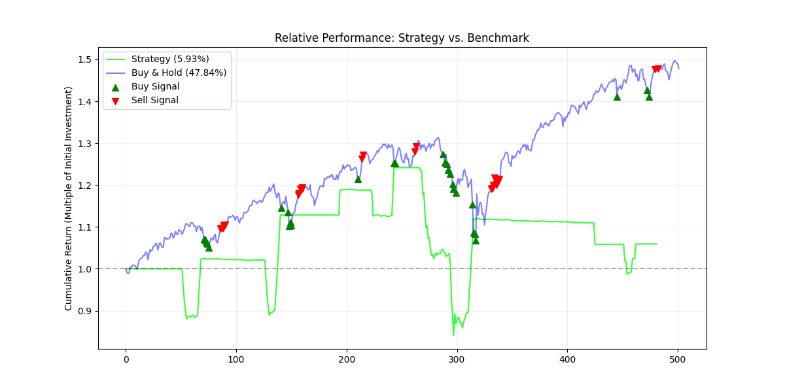

## Setup

### Ensure you have a C++ compiler (Clang/GCC) and CMake

1. Clone the Github repository
```bash
git clone https://github.com/sofitserov/Financial-Instrument-Pricing
```
2. Install the necessary python libraries
```bash
pip install yfinance pandas matplotlib numpy
```

### CMake is used for the build process. 3 & 4 create the AlphaEngine shared object file:
- Keep in mind that steps 4 and 5 must be run every time changes are made to strategy.hpp to update the so file

3. Create and enter build directory:
```bash
mkdir build
cd build
```

4. Generate build files and compile:
```bash
cmake ..
make
```

5. Move the compiled library back to the root directory:
```bash
cp AlphaEngine.cpython-*.so ..
cd ..
```

6. Run:
```bash
python3 test_mr.py
```

## 5/26/2026: File separation and bug fixes
- Bug prevented strategy from buying or selling multiple positions in a row
- main.py now contains 2 functions for calculating the Sharpe ratio as well as running the strategy and plotting results
- Added very simple position sizing where we buy 10% worth of our cash and sell 10% of our total position
- Next steps
    - Implement transaction costs and slippage
    - we also sometimes fall into the trap of having a negative position which requires investigation 


- The chart shows the mean reversion strategy on the S&P 500 from 01-01-2024 to 01-01-2026
- We can see that the strategy buys too aggressively during downturns, so it would be useful to consider more signals before buying
- Perhaps it would be useful to experiment with time-based trades as well as the MR strategy

## 5/24/2026: Overhaul for future expansion
- C++ now handles the moving average calculations 
- strategy.hpp
    - Created an AlphaEngine class which will contain all of the logic for strategies implemented in the future.
    - AlphaEngine objects have StrategyType member variable, which dictate which strategy function to run.
- main.py
    - choose the strategy when creating the AlphaEngine object
    - Compare to benchmark and break-even point
    - Moving average values are no longer hard-coded and are passed as parameters to the run function.

## 5/22/2026: Setup
- Established a code architecture with CMake to combine python and c++ through pybind
- AlphaEngine is a hybrid quantitative backtesting framework that combines the flexibility of Python with the execution power of C++.
- By using pybind11, the project offloads heavy computations and portfolio state management (tracking cash/positions) to C++.

- Wrote a very basic algorithm to track a 20-day and 50-day moving average signal for Pepsi stock from 1/1/2024 - 1/1/2026 to ensure all parts were working as intended

Performance Analysis: Test against baseline
The engine currently benchmarks active strategies against a passive Buy & Hold baseline.

| Metric | Value |
| :--- | :--- |
| **Strategy Return (20/50 SMA)** | -29.69% |
| **Benchmark Return (PEP)** | -10.81% |
| **Alpha** | -18.88% |

### Observation: 
- The negative alpha indicates the 20/50 SMA crossover is too slow for current volatility. 
- This provides a baseline for future optimization using faster indicators or mean-reversion logic. But we are not too worried about the actual strategy at the moment.

### Stateful vs. Stateless Backtesting
- By keeping cash and position as private members in C++ , the engine logs our cash balance. 
- If all cash is spent, the C++ engine will automatically prevent a future buy.


